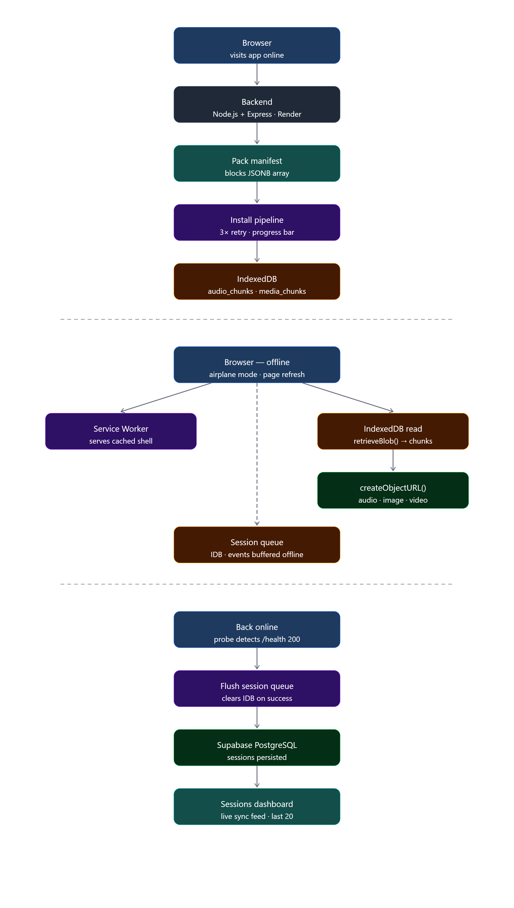

# Offline First Browser Runtime

> A browser runtime that installs audio guide content packs into IndexedDB — chunking audio, images, and video into 1MB blobs — then serves everything locally after a single online visit. Sessions queue in IDB while offline and sync to Supabase when connectivity returns.

<video src="https://github.com/user-attachments/assets/39cec19c-424b-4e6c-8e09-2e8e7b5dd54c" autoplay loop muted playsinline width="100%"></video>

> **Live demo — offline playback after install, session sync on reconnect**

**Live Demo:** https://offlineguide.vercel.app
**Backend API:** https://offline-first-browser-runtime.onrender.com
**Case Study:** https://sujoymondal-tech.vercel.app/case-studies/when-localstorage-stopped-being-enough

---

## Production Context

Extracted from the offline runtime layer of a production no-code platform serving 30+ cultural institution applications across Spain, France, and Belgium. The production implementation handles encrypted scenario data, multi-language TTS, and chunked media blobs across live museum and heritage site deployments — with 600+ verified reviews from users across 35+ countries.

---

## Why this exists

Cultural institutions need audio guides that work inside buildings with poor connectivity — underground galleries, stone-walled rooms, basement exhibitions. Streaming audio on demand fails exactly where visitors need it most.

Traditional approaches either require constant connectivity or rely on native apps with large downloads. This runtime installs content packs directly into the browser's IndexedDB on first visit — splitting every asset into 1MB chunks — then serves audio, images, and video entirely from local storage on every subsequent visit, including after a full page refresh with no network connection.

**Live demo:** https://offlineguide.vercel.app

Install a guide pack while online, switch to airplane mode, refresh the page — everything still works.

---

## Architecture



```
Browser (online)                      Backend (Render)
────────────────                      ────────────────
probeOnline() → GET /health      →    200 OK
Fetch manifest  → GET /api/packs/:id →  { pack, blocks: [...] }
installPack():
  for each block:
    fetch audio_url → Blob
    split into 1MB chunks → IDB('audio_chunks')
    fetch media_url → Blob
    split into 1MB chunks → IDB('media_chunks')
  setInstallState(packId, installed=true)

Browser (offline, after refresh)
─────────────────────────────────
SW intercepts navigation → serves cached index.html
getAllInstalledPacks() ← IDB('install_state')
retrieveBlob('audio_chunks', blockId)
  → reassemble chunks → createObjectURL() → <audio src>
retrieveBlob('media_chunks', blockId)
  → reassemble chunks → createObjectURL() → /<video src>
trackEvent() → IDB('session_queue')

Browser (back online)
──────────────────────
probeOnline() detects reconnect
flushSessionQueue() → POST /api/sessions/sync → Supabase
fetchRecentSessions() ← GET /api/sessions/recent ← Supabase
```

---

## Stack

| Layer | Technology |
|---|---|
| Frontend | React 18 · Vite · TypeScript · Tailwind CSS |
| Runtime | Node.js 22 · TypeScript |
| Offline shell | Service Worker (Cache API — network-first / cache-first) |
| Offline storage | IndexedDB — 5 object stores · 1MB chunk size |
| Backend | Node.js · Express · TypeScript |
| Database | Supabase PostgreSQL (blocks stored as JSONB on pack row) |
| Deploy (frontend) | Vercel |
| Deploy (backend) | Render |
| Keep-warm | UptimeRobot → `/health` every 5 min |

---

## Quick start

**Prerequisites:** Node.js >= 22 · npm >= 10

```bash
git clone https://github.com/sujoymondal87/offline-first-browser-runtime
cd offline-first-browser-runtime

# Backend
cd backend
cp .env.example .env   # fill in Supabase credentials
npm install
npm run dev

# Frontend (separate terminal)
cd frontend
cp .env.example .env   # set VITE_API_URL=http://localhost:3000
npm install
npm run dev
```

Verify the backend is live:
```bash
curl http://localhost:3000/health
```

Run the Supabase schema first — paste `supabase-schema.sql` into your Supabase SQL editor.

---

## Architecture Decisions

**Why IndexedDB instead of the Cache API for media assets?**
The Cache API is designed for HTTP responses — it stores request/response pairs and has no API for chunking large binary files. IndexedDB is a transactional object store that accepts arbitrary blobs. Splitting assets into 1MB chunks and storing them individually avoids browser storage limits on single-blob writes and allows partial retry — if one chunk fails, only that chunk is re-downloaded, not the whole file.

**Why chunk size of 1MB?**
Below 1MB, the number of IDB transactions grows large enough to cause measurable overhead during both write and read. Above 1MB, single-chunk failures waste more bandwidth on retry. 1MB is the practical middle ground for audio/image assets in the 500KB–5MB range.

**Why probe `/health` every 5 seconds instead of using `navigator.onLine`?**
`navigator.onLine` is unreliable — it returns `true` when the device has a network interface, not when the server is actually reachable. Chrome DevTools Offline mode demonstrates this: `navigator.onLine` stays `true` even when all requests fail. Polling `/health` gives a real connectivity signal at the cost of one lightweight request every 5 seconds.

**Why store blocks as JSONB on the pack row instead of a separate blocks table?**
A pack and its blocks are always fetched together — there is no use case for fetching blocks without the pack, or a pack without its blocks. Storing blocks as a JSONB array on the pack row eliminates a join, reduces query complexity, and means the entire pack manifest is one database round-trip. The tradeoff is that individual block updates require rewriting the full JSONB array.

**Why Service Worker for the shell and IndexedDB for assets — not one or the other?**
The Service Worker Cache API excels at caching versioned JS/CSS/HTML files that change on deploy. IndexedDB excels at storing large, user-specific binary data that is installed on demand. Using each for what it is designed for gives the best of both: instant shell load from Cache API, and reliable large-blob storage from IDB.

**Why session events queue in IDB rather than localStorage?**
localStorage is synchronous and blocks the main thread on large writes. It also has a 5–10MB limit per origin and stores only strings — serialising session arrays on every event write adds overhead. IDB is asynchronous, has a much higher storage quota, and supports structured data natively.

---

## Trade-offs

| Trade-off | Detail |
|---|---|
| No streaming — full install required | Users must install a pack before going offline. There is no partial or progressive offline mode. |
| Storage quota varies by device | IDB quota is typically 50% of available disk, but can be as low as a few hundred MB on older devices. Large video packs may hit limits. |
| Blob URLs are session-scoped | `createObjectURL()` returns a URL valid only for the current browser session. Blob URLs must be regenerated from IDB on every page load. |
| JSONB blocks — no partial update | Updating one block requires rewriting the entire JSONB array for that pack. Acceptable for infrequent content updates. |
| Service Worker update delay | SW updates are applied on the next page load after the old SW has been released. Users on the old shell may not see fixes immediately. |
| Position restore — reconnection edge case | When network reconnects while the user is mid-guide, the pack list reloads but position restore is skipped. Player can reset to first block under some timing conditions. |

---

## Lessons learned

- Chunking is necessary, not optional — browsers impose per-entry size limits on IDB writes that vary by browser and OS. Chunking to 1MB makes behaviour consistent and retry granular.
- `navigator.onLine` cannot be trusted — real connectivity detection requires an actual HTTP probe. This cost one bug in early development before the polling approach replaced it.
- Blob URLs must be revoked — `URL.revokeObjectURL()` on block navigation prevents memory leaks when cycling through many stops with large audio files.
- IDB multi-store transactions are fragile across browsers — reading `install_state` and `packs` in a single transaction caused intermittent failures in Safari. Two sequential single-store reads are more reliable.
- Service Worker dev mode requires a guard — without disabling SW registration in development, Vite HMR requests were being intercepted and cached, breaking hot reload entirely.

---

## IDB object stores

| Store | Key pattern | Contents |
|---|---|---|
| `packs` | pack ID | Full pack manifest including blocks JSONB array |
| `install_state` | pack ID | `{ installed: bool, installed_at: ISO string }` |
| `audio_chunks` | `${blockId}_audio_chunks_${i}` | 1MB audio blob chunks |
| `media_chunks` | `${blockId}_media_chunks_${i}` | 1MB image/video blob chunks |
| `session_queue` | auto-increment | Unsynced session events |

---

## API endpoints

| Method | Path | Description |
|---|---|---|
| GET | `/health` | Connectivity probe — returns `{ status: 'ok' }` |
| GET | `/api/packs` | All packs (no blocks) |
| GET | `/api/packs/:id` | Pack with blocks JSONB array |
| POST | `/api/sessions/sync` | Bulk insert session events `{ events: [...] }` |
| GET | `/api/sessions/recent` | Last 20 synced events with pack + block titles |

---

## Environment variables

### Backend (Render)

| Key | Required | Default | Description |
|---|---|---|---|
| `SUPABASE_URL` | Yes | — | From Supabase project settings |
| `SUPABASE_SERVICE_KEY` | Yes | — | Service role key (not anon key) |
| `PORT` | No | `3000` | Server port |
| `NODE_VERSION` | Render only | `22.11.0` | Pin Node version on Render |
| `NPM_CONFIG_PRODUCTION` | Render only | `false` | Ensures devDependencies install on Render |

### Frontend (Vercel)

| Key | Required | Default | Description |
|---|---|---|---|
| `VITE_API_URL` | Yes | — | Backend URL e.g. `https://offline-first-browser-runtime.onrender.com` |

---

## Deployment

### Backend (Render)

| Setting | Value |
|---|---|
| Root directory | `backend` |
| Build command | `npm install && npm run build` |
| Start command | `npm start` |
| Build filters | `backend/**` |
| Node version | `22.11.0` |

### Frontend (Vercel)

| Setting | Value |
|---|---|
| Root directory | `frontend` |
| Build command | `npm run build` |
| Output directory | `dist` |

Keep-warm: UptimeRobot pings `/health` every 5 minutes to prevent Render free-tier spin-down.

---

## Interesting discussion topics

- Why chunk assets into IDB instead of using the Cache API directly?
- How does the connectivity probe differ from `navigator.onLine` and why does it matter?
- What happens to session events recorded while offline — how are they guaranteed to reach the server?
- How would you extend the parent → next block navigation to support branching paths?
- What are the browser storage quota limits and how would you handle a device that runs out of space mid-install?
- How would you handle SW update propagation without forcing a full page reload?

---

## License

MIT
